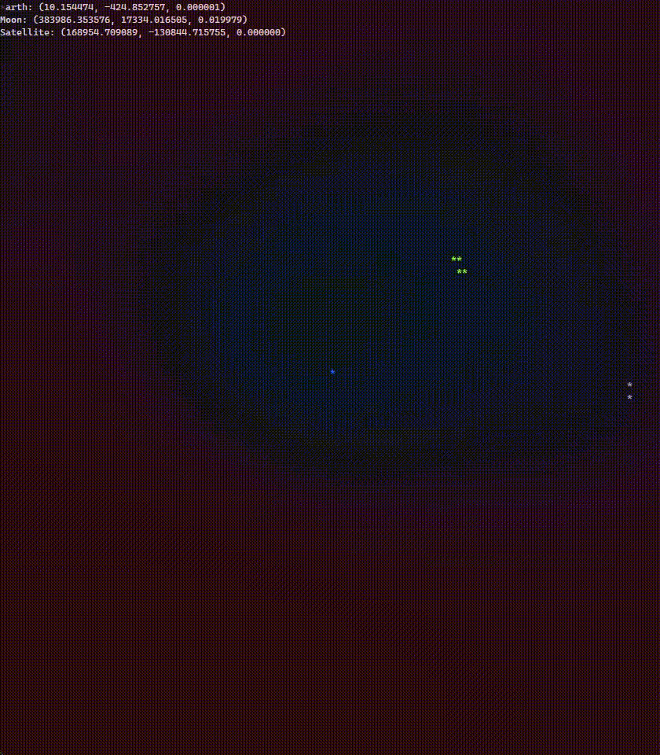

# gsim
 
simple (and fast!) orbital mechanics simulation using vectors  
just something fun i made for the weekend 
mutual gravitational attraction is simulated (increase zoom to see the earth-moon barycenter) 
i made the vectors 3 dimensional but didnt use the z compnoent so i put in a random small value 

## update
- now shows trails
- better visualizations
- added an example satellite
- added randomly generated stars

## bugs
- run in conhost, not wt
